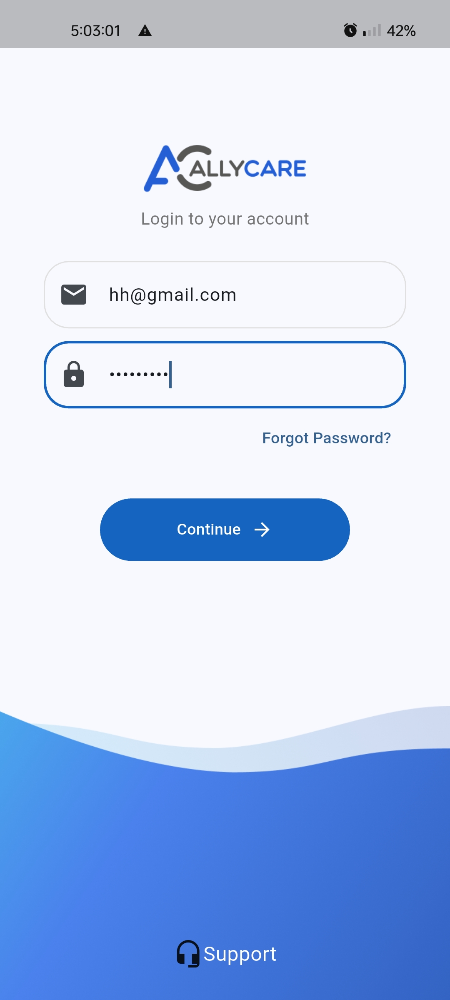
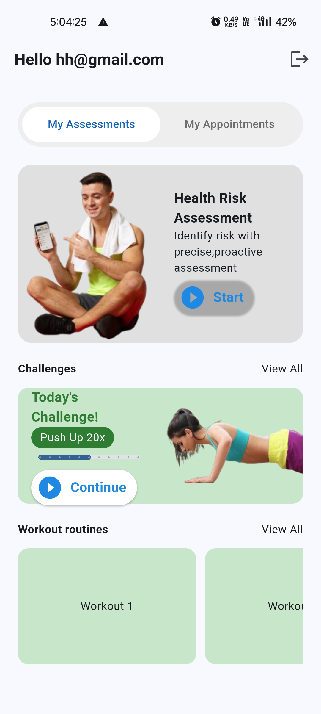

# AllyCare – Flutter Mobile Application  

## 📖 Overview  
**AllyCare** is a Flutter-based mobile application built as part of the Flutter Task assignment.  
The project aimed to combine **modern UI design, Firebase integration, and clean architecture principles** into a production-ready app that supports authentication, assessments, workouts, challenges, and appointment management.  

While I was able to **successfully implement Firebase Authentication** (email/password) and design a **responsive UI that matches the provided Figma designs**, I was not able to fully integrate **Firestore features (pagination, offline caching, and booking)** within the given timeframe.  

Still, the journey was highly valuable — I worked with **Riverpod** for the first time as my chosen state management solution, integrated **Firebase Auth** into a real project setup, and structured the app following **Clean Architecture** to keep it modular, maintainable, and extendable for future development.  

---

## 🚀 Features Implemented  
### ✅ Authentication  
- Firebase Authentication using **Email/Password**.  
- Smooth **loading animation** while checking authentication state.  
- Logout with proper navigation back to the login screen.  

### ✅ Assessments, Workouts & Challenges (UI Layer)  
- Assessment **List & Detail screens** with placeholder integration.  
- **Hero animation** for transitioning between list and detail.  
- Tab-based navigation between **Challenges** and **Workouts**.  
- Favorite toggle system set up using **SharedPreferences** (local).  

### ✅ Architecture & State Management  
- **Riverpod** used for reactive state management.  
- **Clean Architecture layering** to separate data, domain, and presentation.  
- Widgets remain **dumb** while business logic is handled by providers/notifiers.  

### ✅ UI & Responsiveness  
- Strict adherence to **Figma design** (colors, typography, spacing).  
- Responsive layouts tested on:  
  - Small phones  
  - Large phones  
  - Tablets  
- **Material 3 theming** for consistency across screens.  

---

## ❌ Features Pending / Not Completed  
- **Firestore integration** for:  
  - Assessment list with pagination  
  - Offline caching  
  - Pull-to-refresh  
- **Appointments module** with booking and calendar view.  
- **Favorites sync** with Firestore (only local storage implemented).  

Although incomplete, the groundwork is laid out — future developers (or myself) can plug Firestore directly into the existing providers and repositories.  

---

## 📂 Project Structure  
lib/
├── core/ # Shared utilities, constants, themes
├── features/
│ ├── auth/ # Authentication (Firebase + UI)
│ ├── assessments/ # Assessments list + detail screens
│ ├── workouts/ # Workouts list (UI + provider setup)
│ ├── challenges/ # Challenges list (UI + provider setup)
│ ├── appointments/ # Appointment module placeholder
├── common_widgets/ # Reusable widgets
├── main.dart # App entry point

This modular separation follows **Clean Architecture principles**, making the project scalable and maintainable.  

---

## 🛠️ Tech Stack  
- **Flutter** (latest stable)  
- **Riverpod** for state management  
- **Firebase Authentication**  
- **SharedPreferences** for local persistence  
- **Material 3 + Hero animations**  

---

## 📸 Screenshots  

| Login Screen | Assessments | Tablet View |
|--------------|-------------|-------------|
|  |  |  |